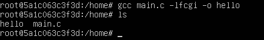
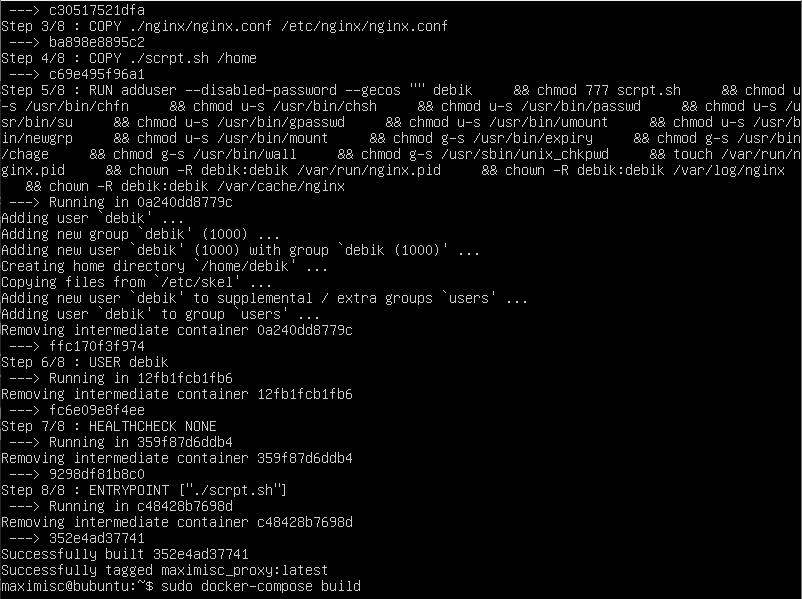

# Simple Docker

Введение в докер. Разработка простого докер-образа для собственного сервера.

## Contents

1. [Chapter I](#chapter-i) \
    1.1. [Готовый докер](#part-1-готовый-докер) \
    1.2. [Операции с контейнером](#part-2-операции-с-контейнером) \
    1.3. [Мини веб-сервер](#part-3-мини-веб-сервер) \
    1.4. [Свой докер](#part-4-свой-докер) \
    1.5. [Dockle](#part-5-dockle) \
    1.6. [Базовый Docker Compose](#part-6-базовый-docker-compose)

## Chapter I

## Part 1. Готовый докер

- Выкачиваем образ nginx командой `docker pull nginx` \

- Проверка наличия образа nginx командой `docker images`
- Запуск образа командой `docker run -d [image_id|repository]`
- Проверка запуска командой `docker ps` \

- Просмотр информации о контейнере командой `docker inspect [container_id|container_name]` \

> размер контейнера - 186722098,\
запампленные порты - 80,\
ip контейнера - 172.17.0.1.

- Остановка докер образа командой `docker stop [container_id|container_name]`
- Проверка наличия остановленного образа командой `docker ps` \

- Запуск образа с портами 80 и 443 в контейнере, замапленных на такие же порты на локальной машине, \

- Проверка через браузер по адресу `localhost:80`. Доступна стартовая страница **nginx** \

- Перезапуск образа командой `docker restart gneg2` \

## Part 2. Операции с контейнером

- Используем контейнер из прошлого раздела и смотрим его конфигурационный файл через команду `sudo docker exec gneg2 cat /etc/nginx/nginx.conf` \

- Копируем конфигурационный файл из докера через команду `sudo docker cp gneg2:/etc/nginx/nginx.conf ./nginx.conf` \

- Настраиваем в нем по пути ***/status*** отдачу страницы статуса сервера **nginx**.

- Копируем его обратно в докер через команду `sudo docker cp ./nginx.conf gneg2:/etc/nginx/nginx.conf`
- Перезапускаем **nginx** внутри докер-образа через команду `sudo docker exec` \

- Проверяем адрес `localhost:80/status` \

- Экспортируем контейнер в файл *container.tar* через команду `docker export -o container gneg2`\

- Останавливаем контейнер через команду `docker stop gneg2`
- Удаляем образ через `docker rmi -f nginx`, не удаляя перед этим контейнер
- Удаляем остановленный контейнер через команду `docker rm gneg2` \

- Импортируем контейнер обратно через команду `docker import -с 'CMD ["nginx", "-g", "daemon off;"]' container.tar gneg_legacy`
- Запускаем импортированный контейнер через команду `docker run --name gneg3 -d -p 80:80 -p 443:443 gneg_legacy` \

- Проверяем, что по адресу `localhost:80/status` отдается страничка со статусом сервера **nginx**

## Part 3. Мини веб-сервер

- Создаем контейнер для нашего мини сервера и заходим в него \

- Устанавливаем все необходиемое в контейнер \

- Настраиваем конфигурационный файл `nginx.conf` \

- Создаем файл main.c после чего пишем код и компилируем его \

- Компилируем main.c командой `gcc main -lfcgi -o hello` \

- Проверяем работоу нашего мини-сервера в браузере \

## Part 4. Свой докер

- Создаем Dockerfile для нашего образа \

- Создаем скрипт для нашего образа который используется для настройки среды контейнера \

- Собираем образ командой `docker build -t mini_server:latest .` \

- Проверяем наличие образа командой `docker images` \

- Запускаем образ командой `docker run -d -p 80:81 -v /home/maximisc/nginx/nginx.conf:/etc/nginx/nginx.conf -d --name serv mini_server:latest` \

- Проверяем работу нашего мини-сервера в браузере \

- Дописываем проксирование странички `/status` в конфигурационный файл `./nginx/nginx.conf` \

- Перезапускаем контейнер командой `docker restart serv` \

- Проверяем работу страницы ***localhost/status*** в браузере \

## Part 5. Dockle

- Устанавливаем Dockle \

- Сканируем образ командой `dockle mini_server` \

- Дописываем Dockerfile для исправления ошибок \

## Part 6. Базовый Docker Compose

- Изменяем файл `scrpt.sh` \

- Изменяем конфигурационный файл `nginx.conf` \

- Убираем все лишнее в `Dockerfile` \

- Собираем образ командой `sudo docker-compose build` \

- Запускаем образ командой `sudo docker-compose up` \

- Проверяем в браузере \

